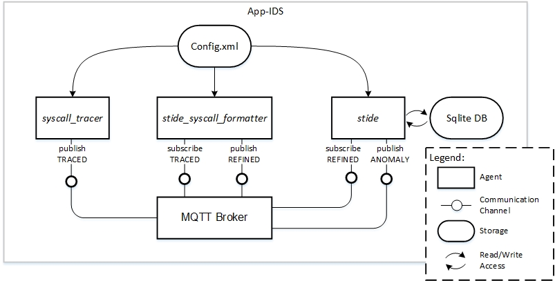

# App-IDS
This is a proof-of-concept implementation of a modular Intrusion Detection System (IDS), whose architecture enables a distributed deployment of modules. Currently, we provide modules that realize the well known sequence time-delay embedding (STIDE 1) approach. Particularly, it's *Full sequence* variant2 3 4. Furthermore, we rely on the [MQTT](https://mqtt.org) protocol to enable communication between modules.

The figure above shows a simplified version of the App-IDS architecture using TAM Block Diagram notation5. The provided modules are:

1. A module called **_syscall_tracer_**, which traces systemcalls using strace.
2. A module called **_stide_syscall_formatter_**, which filters the systemcalls obtained from the tracer.
3. A module  called **_stide_**,  which either stores the obtained and filtered systemcalls or identifies anomalies in streams of systemcall sequences.

## Ressources
- [Quick Start Guide for use with Kuksa](wiki/QuickStart_Kuksa.md)
- [Quick Start Guide for use with Ubuntu 16.04 x64](wiki/QuickStart_Ubuntu.md)
- [The config.xml](wiki/Config.md)
- [Dependencies](wiki/Dependencies.md)
- [Known Limitations and Next Steps](wiki/Limitations.md)

## References
1 Stephanie Forrest, Steven A. Hofmeyr, Anil Somayaji, and Thomas A. Longstaff. A sense of self for Unix processes. In SP’96: Proceedings of the 1996 IEEE Symposium on Security and Privacy, page 120, Washington, DC, USA, 1996. IEEE Computer Society.

2 Stephanie Forrest, Steven Hofmeyr, and Anil Somayaji. Computer immunology. Communications of the ACM, 40(10):88–96, October 1997.

3 Steven A. Hofmeyr, Stephanie Forrest, and Anil Somayaji. Intrusion detection using sequences of system calls. Journal of Computer Security, 6(3), 1998

4 Inoue Hajime and Anil Somayaji. Lookahead pairs and full sequences: a tale of two anomaly detection methods. Proceedings of the 2nd Annual Symposium on Information Assurance. 2007.

5 SAP, AG. Standardized Technical Architecture Modeling: Conceptual and Design Level. Version 1.0. http://www.fmc-modeling.org/download/fmc-and-tam/SAP-TAM_Standard.pdf [accessed 10 April 2019], 2007

