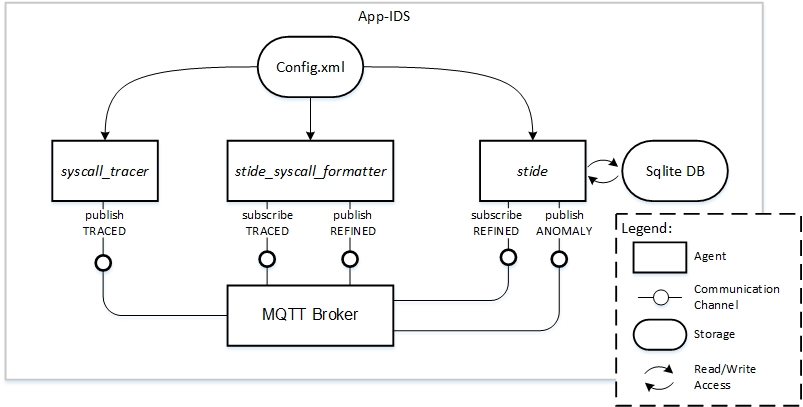

# The config.xml

As depicted in our architecture overview below, the config.xml is the central point to store configuration options for the App-IDS modules. If you want to deploy the modules in a distributed manner, you have to ensure that there a exists a version of config.xml on each device/system. More on this can be found under [Known Limitations and Next Steps](Limitations.md).

At the time of writing, the xml schema for the config.xml can be found [here](../src/xml_validation/configuration_file.xsd). We assume that the xsd is self-explanatory. Examples for valid config.xml files are our [sample file](../src/config.xml) and the examples in our Quick Start Guides ([here](QuickStart_Kuksa.md) and [here](QuickStart_Ubuntu.md)).
